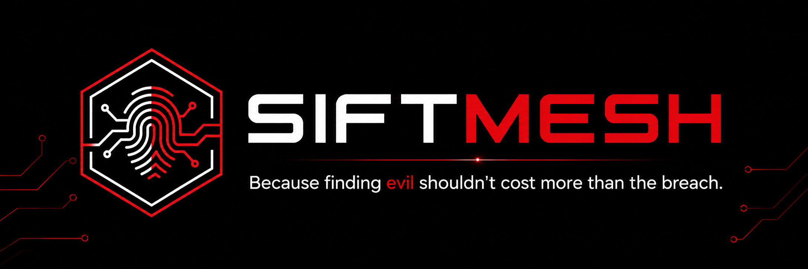
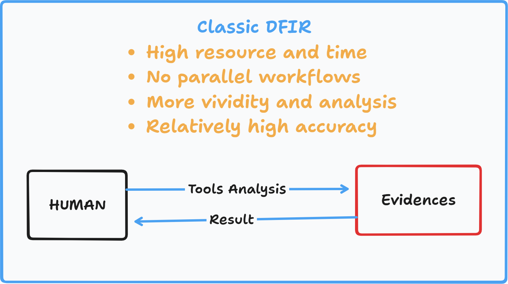
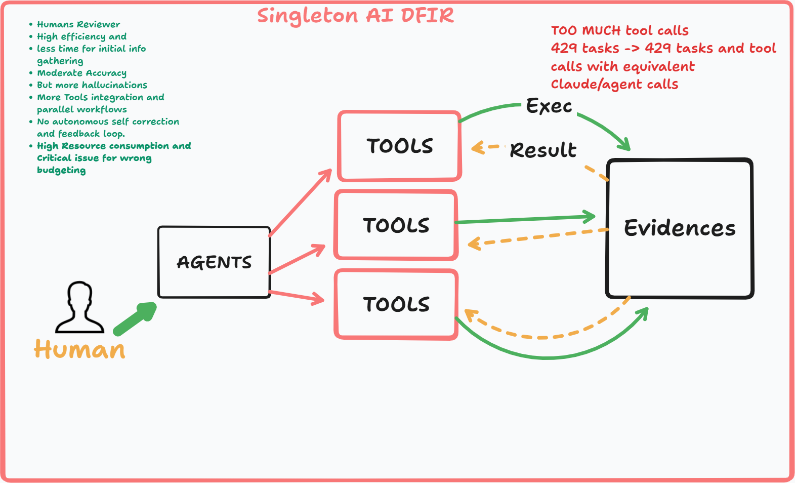
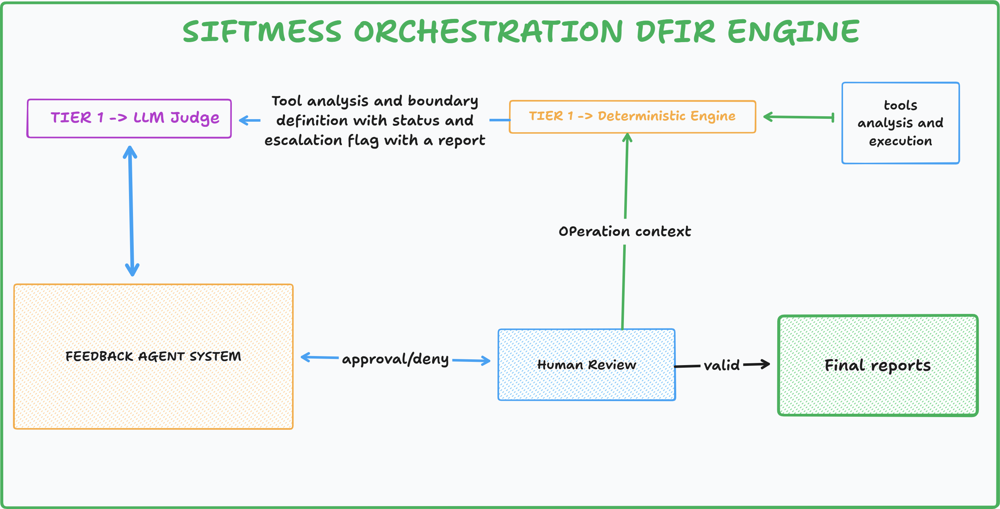
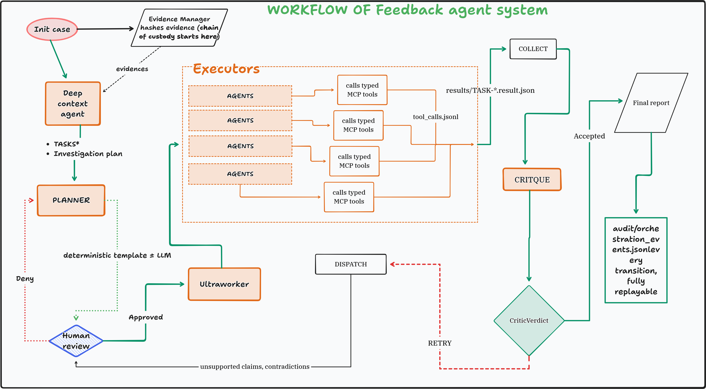

<p align="center">
  
</p>

<p align="center">
  <b>Orchestration of chaos to Find evil, not more agent noise with pro/max...</b><br>
  The LLM proposes; the code decides. Every finding is anchored to a real tool call, and every run is replayable.
</p>

<p align="center">
  🎥 <b>Demo video:</b> <i>&lt;TODO: paste the recorded URL&gt;</i> &nbsp;·&nbsp;
  📋 <b>Submission index (all 8 components):</b> <a href="docs/submission.md"><code>docs/submission.md</code></a>
</p>

---

## Tech stack

Use `uv`; avoid pip/venv. Everything is pinned in `pyproject.toml`.

| Area | Pins |
|---|---|
| Runtime | Python ≥ 3.11 (CI: 3.11 + 3.12), Linux-first (SANS SIFT / Ubuntu) |
| Core | Typer 0.26 · Pydantic 2.13 + pydantic-settings 2.14 · structlog 25 · PyYAML 6 · Jinja2 3.1 · **MCP SDK 1.27** · regipy 6.2.1 · tomlkit 0.13 |
| `sift` extra | evtx 0.11.1 · libscca (prefetch) · mft 0.7 |
| `brief` extra | python-pptx · python-docx · pypdf (read the incident brief) |
| `tui` extra | Textual 8 (the cockpit) |
| `llm` extra | LiteLLM 1.7 (the optional Tier-2 judge only) |
| `a2a` extra | a2a-sdk 1.1 (optional agent-to-agent interop) |
| Dev | ruff · mypy · pytest · hypothesis |

External tools it drives on a SANS SIFT host: Sleuth Kit, Volatility 3, EZ Tools, 7-Zip.

---

## About the project

SIFTMesh is a CLI-first controller for DFIR investigations. It hashes and seals evidence read-only,
plans the work, sends an agent to investigate, and runs a **deterministic critic** to check each claim
against actual tool output before it reaches the report. **Autonomy lives in the agent; determinism
lives in the code.**

**What it can do**

- Hash and seal evidence into a read-only vault with a SHA-256 manifest and a chain-of-custody log.
- Plan from the manifest, dispatch an agent toward your objective, and write an evidence-anchored
  report with a replayable audit trail.
- Run on its own (`run --auto`) or step by step with human gates.
- Stay **agent-neutral**: Claude, Codex, Gemini, OpenCode, or a no-keys deterministic floor.
- Self-correct when the critic rejects an unsupported claim.
- Drive **19 real typed forensic tools** (Sleuth Kit, Volatility 3, EZ Tools, evtx, regipy, prefetch,
  `$MFT`, registry, browser history, LNK/JumpLists, shellbags, Amcache/ShimCache, USN journal, Plaso
  super-timeline). No mocks, no fake output.

**What it is NOT**

- Not a generic multi-agent chatbot, a SOC platform, or a web dashboard.
- The LLM never has the final say on forensic truth.
- Not a replacement for court-vetted tools. It **orchestrates** them; the tools are the source of truth.
- It never runs raw shell, never runs destructive ops, and never writes to your evidence. It fails closed.

**Real results (ROCBA dataset):** [`docs/findings_rocba.md`](docs/findings_rocba.md) and
[`docs/accuracy_report.md`](docs/accuracy_report.md) come from a real run against the provided
evidence (disk image plus memory); [`docs/dataset_documentation.md`](docs/dataset_documentation.md) has
the sealed hashes and how to reproduce; [`docs/execution_logs_sample.md`](docs/execution_logs_sample.md)
traces a finding back to its exact tool execution with real timestamps. The full committed ledgers
for both runs live at `docs/logs/rocba-disk-RUN-20260612-163324/` and
`docs/logs/rocba-memory-RUN-20260612-082630/`. The project story is in
[`docs/project_story.md`](docs/project_story.md).

---

## Pre-setup (recommended)

A live agent is **optional**. The deterministic floor runs the whole pipeline with no API keys. If you
want a live agent, install its CLI **before** `setup` so onboarding can detect it:

```bash
# uv (required)            -> https://docs.astral.sh/uv/
# claude code
npm i -g @anthropic-ai/claude-code      # then: claude setup-token
# any of these also work as the executor or the Tier-2 judge:
npm i -g @openai/codex                   # then: codex login
npm i -g @google/gemini-cli              # then: export GEMINI_API_KEY=...
curl -fsSL https://opencode.ai/install | bash   # then: opencode auth login
```

On a SANS SIFT workstation, the forensic CLIs (sleuthkit, volatility3, 7z, EZ tools) are already
there. You can also onboard agents later from the TUI (`o` → Agent setup); it greys out anything not
ready and shows the fix.

---

## Setup & install

```bash
uv sync                  # base deps + dev tools
uv run siftmesh setup    # installs all backends, probes your agents, lets you pick a set + judge,
                         # and remembers the choice (~/.config/siftmesh/siftmesh.toml)
uv run siftmesh doctor   # fail-closed health check (host + every tool backend)
```

Common commands:

```bash
uv run siftmesh run ./case --evidence ~/data --objective "was this host compromised?" --auto
uv run siftmesh tui            # the live cockpit (or start a new run from it)
uv run siftmesh resume RUN     # continue an interrupted run
uv run siftmesh status RUN     # where is it, what's blocked
```

---

## Features

- **One-command auto run**: init → plan → dispatch → critique → decide → report.
- **Agent-neutral safety tiers (T0 to T3)**: `agents list` shows what is sandboxed and tool-reaching.
- **Optional Tier-2 judge**: advisory only. It can lower confidence or annotate, but never promote.
- **Evidence vault**: SHA-256 manifest, read-only posture, chain-of-custody log.
- **Deterministic critic + self-correction**: unsupported claims are downgraded or dropped.
- **Real-time logs**: every command streams a tagged, per-task, %-complete log to your terminal
  by default (`[info] [agent] [tool_log] [alert] [result] [tasks]`); `--quiet` to silence.
- **Full traceability**: claim/contradiction ledgers, token/agent/tool audit, HTML replay.
- **TUI cockpit**: live read-only run view plus guided new-run onboarding.
- **Low-disk mode**: run in portions, prune between, then merge into one report.

---

## Architecture

SIFTMesh bridges manual DFIR and ungoverned AI agents:

<table>
<tr>
<td width="50%"></td>
<td width="50%"></td>
</tr>
<tr>
<td align="center"><sub><b>Classic DFIR</b> - high time/resource cost, serial, human-bound.</sub></td>
<td align="center"><sub><b>Ungoverned AI agents</b> - fast, parallel, but unverified.</sub></td>
</tr>
</table>

SIFTMesh keeps agent speed and forensic rigor, with **autonomy in the agent, determinism in the code**:

<p align="center">
  
  <br><sub><b>Simplified SIFTMesh architecture</b></sub>
</p>

<p align="center">
  
  <br><sub><b>The agent execution loop at runtime</b> - plan → dispatch → critique → decide, with self-correction.</sub>
</p>

Under the hood it is a deterministic state machine with a few clear roles. The agent is the only part
that "thinks"; everything else is plain code that you can audit and replay.

| Role | Stage | What it does |
|---|---|---|
| **Planner** | `plan` | Reads the sealed manifest, routes each artifact to the right forensic family/tool, writes task contracts. No LLM, never reads evidence bytes. |
| **Executor** | `dispatch` / `collect` | Either the deterministic real-tool floor **or** a live agent (claude/codex/gemini/opencode) investigating toward your objective. Both must emit evidence-anchored claims (a real `tool_call_id` + source hash). |
| **Critic** | `critique` | The deterministic Tier-1 validator **and the only thing allowed to promote a finding.** A claim with no real tool call or source hash gets downgraded or marked unsupported. Catches contradictions and prompt-injection. |
| **Ultraworker** | `decide` | The state machine. It folds the critic's verdicts and decides: done, retry, escalate, human-review, or follow-up, and it enforces the caps plus the self-correction loop. |
| **Tier-2 judge** | advisory | Optional second opinion. Lowers confidence or annotates only; never promotes; never blocks a run. |
| **Reporter / replay** | `report` | Code-built, evidence-backed report plus a replayable audit timeline. Unsupported claims only ever appear in an appendix. |

**Run it step-by-step (manual / full control):**

```bash
siftmesh init-case ./case --evidence ~/data --objective "..."
siftmesh plan      ./case/case_runs/RUN-*
siftmesh dispatch  ./case/case_runs/RUN-*
siftmesh collect   ./case/case_runs/RUN-*
siftmesh critique  ./case/case_runs/RUN-*
siftmesh report    ./case/case_runs/RUN-*
siftmesh replay    ./case/case_runs/RUN-* --html
```

**Or let one engine do all of it (auto):**

```bash
siftmesh run ./case --evidence ~/data --objective "..." --auto \
  --agent claude --max-agent-tasks 400 --max-iterations 5
```

Modes: `--auto` (run to the end), `--auto-human-loop` (stop at meaningful gates), `--review-only`
(plan and stop), or `--mode manual` (one step at a time). Drop `--agent` to run free on the
deterministic floor. When you pick a live `--agent`, **parallel dispatch turns on automatically**
(bounded + deterministic) so a slow agent isn't run serially. Pass `--no-parallel` to opt out.

---

## FAQ: how the "agents" actually work

**Q1 · Are the planner, executor, critic and ultraworker all AI agents?**
No. They are stages of a **deterministic state machine**, not LLMs. Only the **executor** can be an AI
agent, and only if you opt in with `--agent`. With no `--agent`, the whole pipeline runs as plain code
over the real forensic tools (the "deterministic floor") with **no AI at all**. The **planner**,
**critic** and **ultraworker** are always deterministic code; the optional Tier-2 judge is advisory
and can never promote a finding. (Your committed ROCBA results came out this way: real tools, no
AI executor.)

**Q2 · Does the ultraworker dispatch every executor in parallel?**
No, and the ultraworker doesn't dispatch at all. The `decide` stage folds the critic's
verdicts. The **scheduler** does the dispatching in the `dispatch` stage. By **default tasks run one at
a time** (up to `--max-agent-tasks`). Parallel dispatch is **bounded** (`caps.max_parallel_tasks`,
default 3): each task runs isolated in its own staging dir, and results commit in order so the
output is byte-identical to a sequential run. Tasks whose input is a *derived* (carved-from-image)
artifact always run sequentially by design.

**Q3 · Do live AI agents support parallel, and what runs if I don't pass `--agent`?**
Live agents *do* support parallel. Each task gets its own sandboxed agent process and isolated run
dir, and **SIFTMesh now enables it automatically whenever you select a live `--agent`** (sequential
live agents are slow and brittle across many tasks; use `--no-parallel` to force serial). If you **omit
`--agent`**, the deterministic floor runs everything (no AI), independent of `--auto` /
`--auto-human-loop`, which only decide *how far* the engine runs and *where it pauses*, not *who* fills
the executor seat. If you name a live agent that isn't installed/authenticated, it **falls back to the
deterministic floor** (never silently to a different live agent).

**Q4 · Is the disk-then-memory, run-in-portions space optimization autonomous?** Within one run, yes: a single `siftmesh run --auto` over an evidence set hashes, plans, extracts, auto-decompresses any archive, re-ingests the carved artifacts, parses, critiques, and reports with no intervention. Across separate evidence sets with space optimization, it is auto-detected but operator-driven on the CLI. `run` estimates the derived-data size against free disk; if it will not fit it refuses and prints a portion plan. The TUI runs that plan for you (curate a portion, run it, prune the bulky derived data, repeat) then merges. On the CLI you run the portions and combine them with `siftmesh merge`, which is its own command. The committed ROCBA result was two separate runs, disk and memory, combined in `findings_rocba.md`.

---

## What makes it different

| | Generic AI tools | Plain forensic tools | **SIFTMesh** |
|---|---|---|---|
| Who decides truth | the LLM (can hallucinate) | the analyst (manual) | **code decides; LLM only proposes** |
| Provenance | usually none | per-tool | **every claim → tool call + source hash** |
| Chain of custody | no | partial | **sealed manifest + custody log + replay** |
| Autonomy | yes, ungoverned | none | **yes, under deterministic governance** |
| Evidence safety | varies | read-only | **read-only, fails closed** |
| Agent lock-in | usually | n/a | **agent-neutral (swap-in connectors)** |

---

## All commands

**Automated (one engine, modes are config):**

| Command | Does |
|---|---|
| `run CASE --evidence DIR [--auto\|--auto-human-loop\|--review-only\|--mode manual] [--agent …] [--judge …]` | The whole pipeline, end to end. |
| `resume RUN` · `status RUN` | Continue an interrupted run · show state/gates/attempts. |
| `approve RUN --gate G` / `reject RUN --gate G` | Resolve a gate (plan\|dispatch\|retry\|report). |
| `merge CASE --run A --run B …` | Combine ≥2 completed runs into one report. |
| `setup` · `doctor [--setup\|--agents\|--protocol-sift]` | Onboard + persist · health check (fail-closed). |
| `tui [RUN]` | The live cockpit / new-run wizard / onboarding. |

**Staged (full manual control):**

| Command | Does |
|---|---|
| `init-case CASE --evidence DIR [--brief/--objective]` | Hash + seal evidence into a new run. |
| `plan RUN [--review-only]` | Deterministic plan + task contracts. |
| `dispatch RUN` / `collect RUN` / `critique RUN` | Execute → gather → validate claims. |
| `report RUN` / `replay RUN [--html]` | Render reports / replay the audit timeline. |
| `retry RUN TASK` · `prune RUN` | Re-critique one task · reclaim bulky derived data (keep ledgers). |

**Evidence access (audited):**

| Command | Does |
|---|---|
| `evidence extract RUN --image … --keys …` | Recover Windows artifacts from a disk image (Sleuth Kit). |
| `evidence memory RUN --memory …` | Triage a memory image (Volatility 3). |
| `evidence decompress RUN --archive …` / `evidence ingest RUN` | Expand an archive → make it plannable. |

**Inspection (read-only):**

| Command | Does |
|---|---|
| `tasks list\|show` · `claims list\|show` · `audit tail` | Inspect contracts, claims, ledgers. |
| `agents list\|inspect` · `protocol-sift inspect\|skills list` | Onboard agents · inspect the `~/.claude` layer. |

---

## Roadmap

- A2A agent-to-agent interop (optional, governed).
- ACP round-2: typed-tool reach for Gemini/Codex (only Claude reaches the typed tools today).
- Sigma / pySigma detection breadth.
- More SIFT-lane tools, OS-level read-only mounts, and stream parsing for large archives.

---

## License & thanks

Apache-2.0, see [`LICENSE`](LICENSE).

Contributions, issues, and hard questions are welcome.

> *securing digital world one byte at a time*
