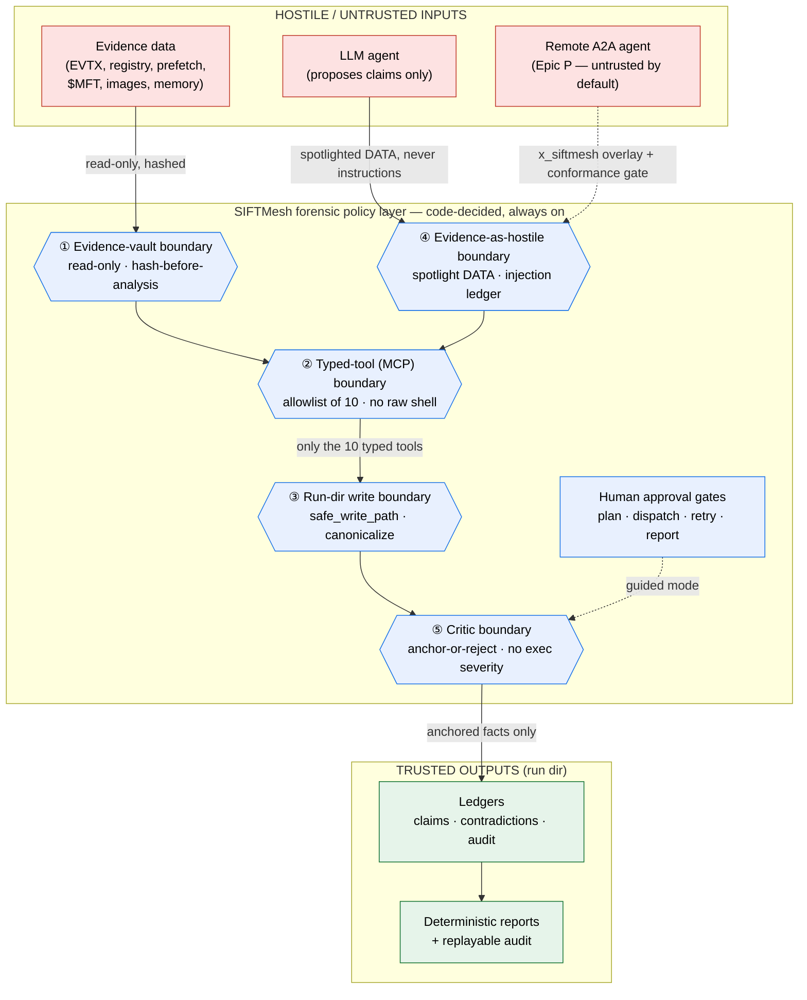

# SIFTMesh Architecture

_Static architecture reference. The run-specific companion is the generated
`reports/architecture_notes.md` (Epic J); the security detail is in
[`threat_model.md`](threat_model.md) and [`evidence_integrity.md`](evidence_integrity.md)._

---

## 1. One sentence

SIFTMesh is a **CLI-first, evidence-safe DFIR orchestration controller**. It hashes and
protects evidence, plans an investigation, dispatches agents constrained to typed forensic
tools, validates every claim against the evidence with a deterministic critic, self-corrects,
and emits byte-deterministic, replayable reports under the rule **"LLM proposes, code decides."**

## 2. Layers

```
Layer 5  CLI (siftmesh …)                  source of truth — every stage callable
Layer 4  Terminal-agent adapters           claude / opencode / headless (gemini,codex) / generic shell / deterministic floor
Layer 3  Orchestration core                planner · ultraworker state machine · critic · budget router
Layer 2  Filesystem investigation bus      case_runs/RUN-*/ (context, tasks, results, claims, audit, reports)
Layer 1  Typed SIFT MCP gateway            10 allowlisted forensic tools (in-process service + thin MCP adapter)
Layer 0  SANS SIFT / Protocol SIFT host    real DFIR tooling (TSK, Volatility, evtx/regipy/scca, …)
```

The CLI calls the typed tool **service** directly. A live agent reaches the same functions over
MCP. The TUI (optional `tui` extra) is read-only over the same run-dir files plus a thin launcher
(see §2b).

### 2a. Agent safety tiers (honest labels, never a gate)

Layer 4 is **agent-agnostic but not safety-blind.** Each connector carries a `safety_tier`
derived purely from the probed capability facts (`schemas/agent_capabilities.py`,
`doctor._agent_safety_tier`), so the label can never disagree with what dispatch actually does:

| Tier | Definition | Today |
|---|---|---|
| **T0** deterministic_floor | real tools, no LLM execution — the safe default | deterministic executor |
| **T1** constrained_live | sandboxed **and** typed tools via strict-MCP | `claude` |
| **T2** unconstrained_live | capable but unsandboxed / tool-reach unproven (explicit opt-in) | `opencode`, `gemini`, `codex` |
| **T3** advisory_llm | tool-less Tier-2 judge — never promotes | `--judge …` / `litellm:<model>` |

Tiers are **labels only** — they never gate dispatch (`--agent opencode` is unchanged); they make
the containment posture visible in `agents list` / `doctor --agents` / the cockpit and in
`context/agent_capabilities.json`. The floor is the default, Claude is the constrained executor,
opencode/codex/gemini are explicit unconstrained opt-ins, and LiteLLM is advisory-only (it never
executes a tool).

### 2b. The Textual cockpit (read-only over the run dir)

The cockpit renders `run_state.json` + the JSONL ledgers on a poll; launching a run goes through the
**same** governed engine, so the UI never decides anything. Three surfaces:

- **Home** — minimal: a centered *New run*, a left list of recent runs badged
  `terminal`/`blocked:<gate>`/`paused`/`running`, and visible key hints (`n` new · `Enter` attach ·
  `r` resume · `o` agents · `ctrl+t` theme · `q` quit).
- **New-run wizard** (2 screens, Textual-free `WizardDraft` core) — Screen 1: case name + a
  **filesystem-wide evidence picker** (a re-rootable `DirectoryTree` reachable *above* the project dir
  via Up/Home/`/` + a breadcrumb, a `#file` / `#folder` fuzzy search box backed by
  `tui/fs_search.py`, and a left preview that never reads a huge/binary file into memory) + the
  brief/objective. Picks are hardlinked into a curated dir (`evidence/curate.py`, originals untouched).
  Screen 2: the Verify + Space readiness synthesis (host checks + derived-size vs free disk →
  full / single / portions) + the run options + Launch.
- **Onboarding** (`o` / Agent setup) — a `TabbedContent` with **Agents** (a greyed-until-ready
  multiselect; not-installed/not-authed agents are disabled with the exact fix from
  `doctor.agent_remediation`; a *Launch auth* button runs the vendor login via `App.suspend()`; a 2 s
  background re-probe flips an agent selectable the moment auth lands) and **Tier-2 judge** (a provider
  radio: claude/codex/opencode via their own login, or gemini/opencode-go-zen/custom via a LiteLLM API
  key). Provider keys are validated then saved to a 600-perm `~/.config/siftmesh/.env`
  (`secrets_env.py` + `tui/auth_actions.py`) — **never** to `siftmesh.toml`.

## 3. Agent roles → multi-agent patterns

Each role maps to a pattern from Anthropic's _Building Effective Agents_. Autonomy lives in the
agent (the Executor + the optional LLM Planner/Deep-Context/judge); determinism lives in the
governance (Ultraworker state machine · Critic · `decide()` · caps · evidence-safety · replayable
audit). **"LLM proposes, code decides."**

| Role | Pattern | Responsibility | MVP backing |
|---|---|---|---|
| **Planner** | prompt-chaining + orchestrator decomposition | plan + task graph; never executes tools | deterministic template (always) **+ optional LLM planning** |
| **Deep-Context** | single-shot summarizer | compact reusable context pack | deterministic (always) **+ optional LLM** |
| **Ultraworker** | orchestrator-workers + state machine | task order, dispatch, retry/escalate/human, caps | deterministic engine (always — governance) |
| **Executor** | tool-use loop | one narrow task; extract/normalize; cite evidence; **no** final severity | **live LLM agent (PRIMARY)** via the agent-neutral headless connector (claude = T1 strict-MCP; opencode/gemini/codex = T2 opt-in) **+** deterministic real-tool floor (T0; regression floor) / generic shell |
| **Critic** | evaluator-optimizer | reject unsupported, find contradictions, drive retry | deterministic structural (always; **sole promoter**) **+ advisory Tier-2 LLM judge** (`adapters/judge.py`, provider-flexible, fail-soft, never promotes) |
| **Budget Router** | routing | cheap-vs-strong selection; escalate on retry/contradiction | static map + escalate-on-retry |
| **Prompt-Injection Guard** | — | spotlight + scan evidence; alert, never execute | deterministic scanner (always) |
| **Evidence Manager** | — | hashes, read-only posture, derived registry, claim↔evidence map | always real |

**The agent loop (per task).** The Executor runs a bounded tool-use loop: it receives one narrow
task contract + the **spotlighted** evidence (data, never instructions), calls the typed MCP tools,
and returns evidence-anchored claims (each with a real `tool_call_id` + `source_sha256`). It never
assigns final severity and never sees other tasks' raw evidence. The **run loop** around it is the
self-correction cycle in §5: dispatch → collect → critique → decide → (retry with a tightened
contract) — driven by code, not by the model.

## 4. Data-flow (one investigation)

```
init-case ─► Evidence Manager hashes evidence (SHA-256) ─► evidence_manifest.json + hashes.sha256
   │                                                         (chain of custody starts here)
   ▼
Deep-Context (template/LLM) ─► context_pack.md
   ▼
Planner (deterministic template ± LLM) ─► investigation_plan.yaml + tasks/TASK-*.yaml
   ▼  [HUMAN_GATE_PLAN?]
Ultraworker.dispatch ─► ExecutorAdapter(deterministic|shell|claude|opencode|headless) runs TASK with SPOTLIGHTED evidence
   │                       └─► calls typed MCP tools ─► tool_calls.jsonl (provenance)
   ▼
collect ─► results/TASK-*.result.json
   ▼
Critic.critique ─► structural validation ─► CriticVerdict
   │   ├─ accepted          ─► claim_ledger.jsonl
   │   ├─ retry_required    ─► unsupported_claims.jsonl + confidence_changes.jsonl
   │   └─ contradiction     ─► contradiction_ledger.jsonl
   ▼
decide() (pure fn, CLAUDE.md §12) ─► {DONE | RETRY | ESCALATE | HUMAN_REVIEW | FOLLOW_UP}
   │      RETRY ─► new TASK (tightened) ─► back to dispatch        (THE SELF-CORRECTION LOOP)
   ▼  [FINAL_HUMAN_GATE?]
report ─► final_report.md + accuracy_report.md   ·   replay ─► replay.html
   │                              (all generated deterministically from JSONL ledgers)
   ▼
audit/orchestration_events.jsonl  ── every transition, fully replayable
```

## 5. The deterministic state machine (Layer 3 core)

```
INIT
 └─► CREATE_EVIDENCE_VAULT
      └─► DEEP_CONTEXT
           └─► PLAN
                └─► [HUMAN_GATE_PLAN]        (guided modes only)
                     └─► DISPATCH ◄────────────────┐
                          └─► COLLECT             │
                               └─► CRITIQUE       │
                                    └─► DECIDE ────┤
                                         ├─► RETRY ┘   (per-task max_attempts)
                                         ├─► FOLLOW_UP ┘ (coverage / corroboration gap)
                                         ├─► ESCALATE ─► DISPATCH (strong profile)
                                         ├─► HUMAN_REVIEW ─► [HUMAN_GATE_RETRY]
                                         └─► REPORT
                                              └─► [FINAL_HUMAN_GATE]
                                                   └─► DONE
```

- The transition table is a **frozen `dict[State, set[State]]`** in `orchestrator/state_machine.py`.
  An LLM-proposed next-state that isn't in the legal set is **rejected and logged**
  (`illegal_transition_rejected`).
- **Two distinct counters:** per-task `max_attempts` (default 2) lives in
  `RunState.per_task[id].attempt`; global `max_iterations` (default 3) lives in `RunState.iteration`.
  They gate different transitions.
- `RunState` is persisted atomically (`run_state.json`, temp+rename) for crash-safe `resume`; the
  cockpit's cooperative pause stops at one of these boundaries (always resumable).
- **Modes are config, not separate code** — `manual` (one step per call), `review_only` (plan, stop),
  `auto_human_loop` (run to a meaningful gate), `auto` (run to terminal under the caps).

## 6. Security boundaries

The five code-decided boundaries every byte of hostile input must cross. Source:
[`diagrams/security_boundaries.mmd`](diagrams/security_boundaries.mmd) (render with
`mmdc -i security_boundaries.mmd -o security_boundaries.svg`). GitHub renders the inline copy:



| # | Boundary | Control | Module | Bypass test |
|---|---|---|---|---|
| ① | Evidence vault | read-only + hash-before-analysis | `evidence/readonly.py`, `manifest.py` | `test_bypass_evidence_readonly.py` |
| ② | Typed-tool (MCP) | allowlist of 10, no raw shell | `mcp_gateway/registry.py` | `test_bypass_forbidden_tool.py` |
| ③ | Run-dir write | `safe_write_path` canonicalize | `evidence/path_policy.py` | `test_bypass_path_escape.py` |
| ④ | Evidence-as-hostile | spotlight + injection ledger | `adapters/spotlight.py` | `test_bypass_injection.py` |
| ⑤ | Critic | anchor-or-reject | `orchestrator/critic.py` | `test_bypass_claim_no_toolcall.py` |

**Why boundary ② is strong:** the core path is **in-process typed Python lib calls** — 8 of the 10
tools never spawn a subprocess, so there is no command string to inject into at all. Only image
extraction (Sleuth Kit) and memory triage (Volatility 3) shell out, and those use **fixed-argv,
`shell=False`** with no evidence string interpolated into a command (PLAN/08). See
[`threat_model.md`](threat_model.md) §6 for the policy-layer comparison to CAO/Valhuntir.

## 7. Key directories

```
siftmesh_core/
  cli.py                 # Typer CLI — the source of truth
  config.py              # SiftmeshSettings (+ agent_aliases · judge_api_base · judge_drop_params) · save_agent_selection
  secrets_env.py         # provider API keys → 600-perm ~/.config/siftmesh/.env (never in siftmesh.toml)
  orchestrator/          # state_machine · workflow_runner · planner · critic · ultraworker · decide · budget_router
  schemas/               # Pydantic StrictModels (run · task · claim · audit · tool_result · …)
  evidence/              # vault · manifest · readonly · hash_utils · path_policy · curate
  mcp_gateway/           # registry (allowlist) · server (thin MCP adapter) · tools/*
  ledgers/               # claim · contradiction · injection_alerts · audit (JSONL)
  adapters/              # claude · opencode · headless · generic_shell · deterministic floor · spotlight · judge
  reports/               # loader → render → final/accuracy/dataset/architecture + replay (Epic J)
  tui/                   # cockpit · wizard · setup_screen · fs_search · auth_actions · space_view · snapshot (Textual)
docs/                    # architecture · threat_model · evidence_integrity · diagrams/
```
