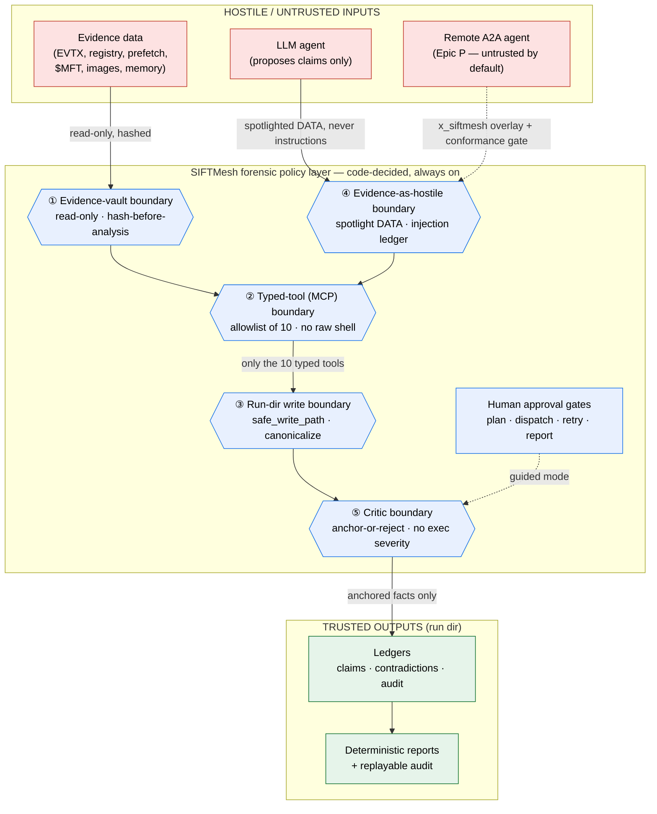

# SIFTMesh Architecture

_Static architecture reference. The run-specific companion is the generated
`reports/architecture_notes.md` (Epic J); the security detail is in
[`threat_model.md`](threat_model.md) and [`evidence_integrity.md`](evidence_integrity.md)._

---

## 1. One sentence

SIFTMesh is a **CLI-first, evidence-safe, agent-agnostic DFIR orchestration controller**:
it hashes and protects evidence, plans an investigation, dispatches a (possibly live,
possibly deterministic) agent constrained to typed forensic tools, validates every claim
against the evidence with a deterministic critic, self-corrects, and emits byte-deterministic,
replayable reports — all under the rule **"LLM proposes, code decides."**

## 2. Layers

```
Layer 5  CLI (siftmesh …)                  source of truth — every stage callable
Layer 4  Terminal-agent adapters           claude / opencode / generic shell / deterministic floor
Layer 3  Orchestration core                planner · ultraworker state machine · critic · budget router
Layer 2  Filesystem investigation bus      case_runs/RUN-*/ (context, tasks, results, claims, audit, reports)
Layer 1  Typed SIFT MCP gateway            10 allowlisted forensic tools (in-process service + thin MCP adapter)
Layer 0  SANS SIFT / Protocol SIFT host    real DFIR tooling (TSK, Volatility, evtx/regipy/scca, …)
```

The CLI calls the typed tool **service** directly (CLI-first); a live agent reaches the
same functions over MCP. The TUI (optional `tui` extra) is a **read-only cockpit** over the
same run-dir files plus a thin launcher — never a second copy of the logic (see §2b).

### 2b. The Textual cockpit (read-only over the run dir)

The cockpit renders `run_state.json` + the JSONL ledgers on a poll; launching a run goes through the
**same** governed engine, so the UI never decides anything. Three surfaces:

- **Home** — minimal: a centered *New run*, a left list of recent runs badged
  `terminal`/`blocked:<gate>`/`paused`/`running`, and visible key hints (`n` new · `Enter` attach ·
  `r` resume · `o` agents · `ctrl+t` theme · `q` quit).
- **New-run wizard** (2 screens, Textual-free `WizardDraft` core) — Screen 1: case name + a
  **filesystem-wide evidence picker** (a re-rootable `DirectoryTree` reachable *above* the project dir
  via Up/Home/`/` + a breadcrumb, a `#file` / `#folder` fuzzy search box backed by
  `tui/fs_search.py`, and a left preview that never reads a huge/binary file into memory) + the
  brief/objective. Picks are hardlinked into a curated dir (`evidence/curate.py`, originals untouched).
  Screen 2: the Verify + Space readiness synthesis (host checks + derived-size vs free disk →
  full / single / portions) + the run options + Launch.
- **Onboarding** (`o` / Agent setup) — a `TabbedContent` with **Agents** (a greyed-until-ready
  multiselect; not-installed/not-authed agents are disabled with the exact fix from
  `doctor.agent_remediation`; a *Launch auth* button runs the vendor login via `App.suspend()`; a 2 s
  background re-probe flips an agent selectable the moment auth lands) and **Tier-2 judge** (a provider
  radio: claude/codex/opencode via their own login, or gemini/opencode-go-zen/custom via a LiteLLM API
  key). Provider keys are validated then saved to a 600-perm `~/.config/siftmesh/.env`
  (`secrets_env.py` + `tui/auth_actions.py`) — **never** to `siftmesh.toml`.

### 2a. Agent safety tiers (honest labels, never a gate)

Layer 4 is **agent-agnostic but not safety-blind.** Each connector carries a `safety_tier`
derived purely from the probed capability facts (`schemas/agent_capabilities.py`,
`doctor._agent_safety_tier`), so the label can never disagree with what dispatch actually does:

| Tier | Definition | Today |
|---|---|---|
| **T0** deterministic_floor | real tools, no LLM execution — the safe default | deterministic executor |
| **T1** constrained_live | sandboxed **and** typed tools via strict-MCP | `claude` |
| **T2** unconstrained_live | capable but unsandboxed / tool-reach unproven (explicit opt-in) | `opencode`, `gemini`, `codex` |
| **T3** advisory_llm | tool-less Tier-2 judge — never promotes | `--judge …` / `litellm:<model>` |

Tiers are **labels only** — they never gate dispatch (`--agent opencode` is unchanged); they make
the containment posture visible in `agents list` / `doctor --agents` / the cockpit and in
`context/agent_capabilities.json`. This is the "measure capability, label risk" posture: the floor
is the default, Claude is the constrained executor, opencode/codex/gemini are explicit
unconstrained opt-ins, and LiteLLM is advisory-only (it never executes a tool).

## 3. State machine

```
INIT → CREATE_EVIDENCE_VAULT → DEEP_CONTEXT → PLAN →[gate]→ DISPATCH → COLLECT → CRITIQUE → DECIDE
        DECIDE → RETRY/ESCALATE → DISPATCH   |   DECIDE → HUMAN_REVIEW →[gate]   |   DECIDE → REPORT →[gate]→ DONE
```

Deterministic transition table + pure `step()`; `RunState` is persisted atomically
(`run_state.json`) for crash-safe `resume`. The LLM can recommend an action; the state
machine decides whether it is legal. Caps (`max_iterations`, `max_agent_tasks`,
`max_tool_runtime_seconds`, `agent_timeout`) bound every auto run.

## 4. Security boundaries (Epic L6)

The five code-decided boundaries every byte of hostile input must cross. Source:
[`diagrams/security_boundaries.mmd`](diagrams/security_boundaries.mmd) (render with
`mmdc -i security_boundaries.mmd -o security_boundaries.svg`). GitHub renders the inline
copy below:



| # | Boundary | Control | Module | Bypass test |
|---|---|---|---|---|
| ① | Evidence vault | read-only + hash-before-analysis | `evidence/readonly.py`, `manifest.py` | `test_bypass_evidence_readonly.py` |
| ② | Typed-tool (MCP) | allowlist of 10, no raw shell | `mcp_gateway/registry.py` | `test_bypass_forbidden_tool.py` |
| ③ | Run-dir write | `safe_write_path` canonicalize | `evidence/path_policy.py` | `test_bypass_path_escape.py` |
| ④ | Evidence-as-hostile | spotlight + injection ledger | `adapters/spotlight.py` | `test_bypass_injection.py` |
| ⑤ | Critic | anchor-or-reject | `orchestrator/critic.py` | `test_bypass_claim_no_toolcall.py` |

Why this is a **forensic policy layer**, not just a harness sandbox — and how it compares
to CAO and Valhuntir — is in [`threat_model.md`](threat_model.md) §6.

## 5. Key directories

```
siftmesh_core/
  cli.py                 # Typer CLI — the source of truth
  config.py              # SiftmeshSettings (+ agent_aliases · judge_api_base · judge_drop_params) · save_agent_selection
  secrets_env.py         # provider API keys → 600-perm ~/.config/siftmesh/.env (never in siftmesh.toml)
  orchestrator/          # state_machine · workflow_runner · planner · critic · ultraworker · budget_router
  schemas/               # Pydantic StrictModels (run · task · claim · audit · tool_result · …)
  evidence/              # vault · manifest · readonly · hash_utils · path_policy · curate
  mcp_gateway/           # registry (allowlist) · server (thin MCP adapter) · tools/*
  ledgers/               # claim · contradiction · injection_alerts · audit (JSONL)
  adapters/              # claude · opencode · headless · generic_shell · deterministic floor · spotlight · judge
  reports/               # loader → render → final/accuracy/dataset/architecture + replay (Epic J)
  tui/                   # cockpit · wizard · setup_screen · fs_search · auth_actions · space_view · snapshot (Textual)
docs/                    # architecture · threat_model · evidence_integrity · diagrams/
```
